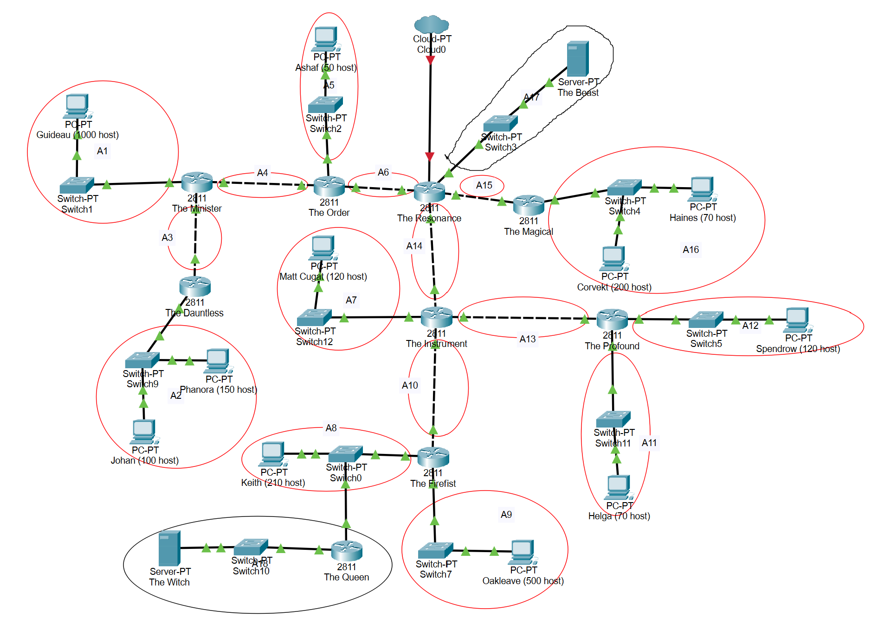

# Jarkom-Modul-4-B08-2022

## Anggota Kelompok
<table>
 	<tr>
 		<td> Nama </td>
 		<td> NRP</td>
 	</tr>
 	<tr>
 		<td> Aaliyah Farah Adibah </td>
 		<td> 5025201070 </td>
 	</tr>
  <tr>
 		<td> Rafael Asi Kristanto Tambunan </td>
 		<td> 5025201168 </td>
 	</tr>
  <tr>
 		<td> Sejati Bakti Raga </td>
 		<td> 5025201007 </td>
 	</tr>
 </table>
 
 ## Daftar Isi
  + [Soal](#soal)
  + [Jawaban](#jawaban)
  + [Kendala](#kendala)
  
 ## Soal
 	1. Soal shift dikerjakan pada Cisco Packet Tracer dan GNS3 menggunakan metode perhitungan CLASSLESS yang berbeda.
	   Keterangan: Bila di CPT menggunakan VLSM, maka di GNS3 menggunakan CIDR atau Sebaliknya
	2. Jika tidak ada pemberitahuan revisi soal dari asisten, berarti semua soal BERSIFAT BENAR dan DAPAT DIKERJAKAN.
	3. Untuk di GNS3 CLOUD merupakan NAT1 jangan sampai salah agar bisa terkoneksi internet.
	4. Pembagian IP menggunakan Prefix IP yang telah ditentukan pada modul pengenalan
	5. Pembagian IP dan routing harus SE-EFISIEN MUNGKIN.
	
## Jawaban
1. 
2. Cisco

3. GNS

 
 ## Kendala
+ Aaliyah Farah Adibah

	1. Kurang memahami penggunaan CISCO
	2. Cisco yang sering failed saat di test, sehingga perlu berkali-kali ngetest ulang
	
+ Rafael Asi Kristanto Tambunan

	1. Penggunaan CISCO yang masih baru
	2. GNS yang sering error saat digunakan
	3. Sering terjadi kegagalan yang membuat harus menrun ulang

+ Sejati Bakti Raga

	1. ...
	2. ...

